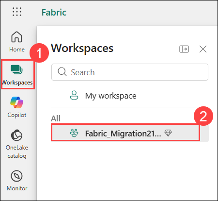
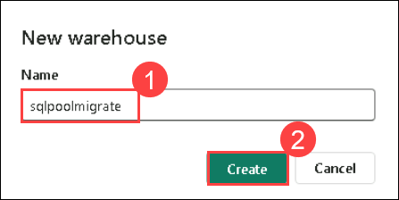
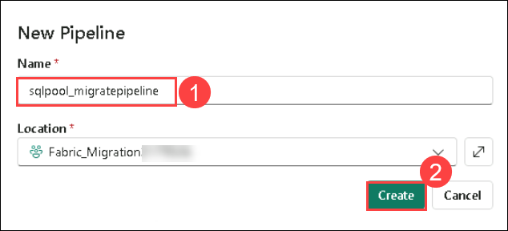
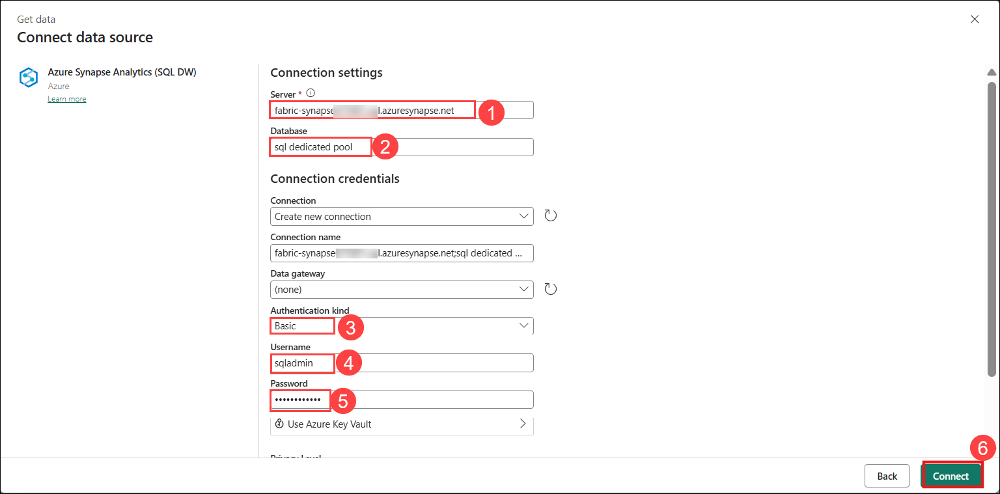

## Lab 2: Migrate Azure Synapse Analytics SQL objects to Fabric Data Warehouse

### Estimated Duration: 120 Minutes

## Overview

This lab focuses on migrating SQL objects and data from **Azure Synapse Analytics (Dedicated SQL Pool)** to **Microsoft Fabric Data Warehouse**. It demonstrates how to create a warehouse in Fabric, establish a connection to Synapse, and use pipelines to copy data into OneLake. The lab also covers validating migrated data and scheduling pipelines for automated data movement.

## Objectives

By the end of this lab, you will be able to:

- Task 1: Create a Warehouse
- Task 2: Create Linked Connection to Synapse SQL
- Task 3: Schedule the Pipeline

## Task 1: Create a Warehouse

1. Open your browser and navigate to the following URL to open **Microsoft Fabric** portal: 

    ```
    https://app.fabric.microsoft.com/
    ``` 

1. Select **Workspaces (1)** from the left navigation pane, and then choose **Fabric_Migration<inject key="DeploymentID" enableCopy="false"/> (2)** from the list.

    

1. Click **+ New item (1)**, then select **Warehouse (2)** to create a new Fabric Warehouse.

    

1. In the **New warehouse** dialog box, enter **sqlpoolmigrate (1)** in the **Name** field, click **Create (2)** and open the new warehouse.

    

    

> **Congratulations** on completing the task! Now, it's time to validate it. Here are the steps:
> - Hit the Validate button for the corresponding task.
> - If you receive a success message, you can proceed to the next task.
> - If not, carefully read the error message and retry the step, following the instructions in the lab guide. 
> - If you need any assistance, please contact us at cloudlabs-support@spektrasystems.com. We are available 24/7 to help you out.

<validation step="1ee57940-621b-4154-aeb5-75fd27b16bd0" />    

## Task 2: Create Linked Connection to Synapse SQL

1. Select **Workspaces (1)** from the left navigation pane, and then choose **Fabric_Migration<inject key="DeploymentID" enableCopy="false"/> (2)** from the list.

    

1. In the **Fabric_Migration<inject key="DeploymentID" enableCopy="false"/>** page, select **+ New item (1)**, then click **Pipeline (2)** to view the full list of available items under **Get data**.

    

1. In the **New pipeline** dialog box, enter **sqlpool_migratepipeline (1)** in the **Name** field, then click **Create (2)**.

    

1. On newly created pipeline, select **Copy data (1)** dropdown and choose **Add copy data activity (2)** option.

    

1. With the **copy data** being selected, navigate to **Source** tab.

    

1. Select the **Connection** dropdown **(1)** and select **Browse all (2)** option.

    

1. Select **+ New** from the left pane.  

    

1. From the data source options, select **Azure Synapse Analytics (SQL DW)** to begin the connection setup.

    

1. Select **New Connection → Azure Synapse Analytics (SQL)** and enter the following details, then click **Connect (6)**:


    | Field    | Value                                              |
    |----------|----------------------------------------------------|
    | Server   | Enter Dedicated SQL Endpoint that you pasted into the Notepad in **Task 2 → Step 7** **(1)**   |
    | Database | **sql dedicated pool (2)**                  |
    | Authentication | **Basic (3)**      |
    | Username | `sqladmin`  **(4)**                                        |
    | Password | `password321!`  **(5)**                                     |

     

1. Under Source tab, open the **Table** dropdown and select the **fabric_employee** table.

    

    

1. Now, navigate to **destination** tab.

    

1. Select the **Connection** dropdown **(1)** and select **Browse all (2)** option.

    

1. On choose a destination window, select **OneLake catalog** from the left pane and select the **sqlpoolmigrate**.

    

    

1. In the **Destination** tab, select **Auto create table (1)**, specify the schema as **dbo (2)**, and enter the table name as **employee (3)** to automatically create and load data into the table.

    

1. Click on **Run** to run the copy data.

    

1. Click on **Save and run** button so that pipeline will be save and
    run.

    

    

    

1. After the successful execution of the pipeline, go to your SQL analytics endpoint Lakehouse and open the explorer to see the imported data.

1. Select **Fabric_Migration<inject key="DeploymentID" enableCopy="false"/> workspace (1)** from the left navigation, and select **sqlpoolmigrate (2)** to view and access the created warehouse.

    

1. Expand **sqlpoolmigrate**, navigate to **Schemas → dbo → Tables**, and select the **employee** table to verify that it has been successfully created and loaded.

    

1. Select **New SQL query** to write your SQL statements.

    

1. Enter the following query **(1)**, then click the **Run (2)** icon to run it and observe the counts in the **output (3)**.

    ```
    SELECT COUNT(*) FROM dbo.employee;
    ```

    

1. Enter the following query **(1)**, then click the **Run (2)** icon to run it and observe the results.

    ```
    SELECT TOP 10 * FROM dbo.employee;
    ```
    

1. Compare row counts with Synapse: return to the Synapse workspace, navigate to the **Develop (1)** section, click the **+ (2)** button, and select **SQL script (3)** to create a new SQL script.

    

1. Ensure that the SQL script is connected to the **SQL dedicated pool** by selecting it from both the **Connect to** dropdown and the **Use database** dropdown, as highlighted in the image

    

1. Enter the following code **(1)** into the editor and click **Run (2)** to execute it.

    ```
    SELECT COUNT(*) FROM dbo.fabric_employee;
    ```

    

    

    > **Note:** we had renamed *dbo.fabric_employee* to *dbo.employee* for migration

> **Congratulations** on completing the task! Now, it's time to validate it. Here are the steps:
> - Hit the Validate button for the corresponding task.
> - If you receive a success message, you can proceed to the next task.
> - If not, carefully read the error message and retry the step, following the instructions in the lab guide. 
> - If you need any assistance, please contact us at cloudlabs-support@spektrasystems.com. We are available 24/7 to help you out.

<validation step="01133add-9237-42c6-b39e-0dd25c717758" />    

## Task 3: Schedule the Pipeline

1. Navigate back to the Fabric portal, click **Fabric_migration<inject key="DeploymentID" enableCopy="false"/>** in the left navigation pane, and then select **sql_migratepipeline**.

    

1. Click **Schedule**.

    

1. Click **+ Add schedule** to configure a new schedule for automatically running the pipeline.

    

1. Configure the schedule as required. The example here schedules the pipeline to execute daily at 8:00 PM until the end of the year.

1. In Failure notification, enter the **<inject key="AzureAdUserEmail"></inject> (1)** . Select **Daily (2)** under Repeat, set Time of day, and click Save **(3)** to schedule the pipeline execution.

    

## Review

In this lab, you successfully migrated data from Azure Synapse Analytics to Microsoft Fabric Data Warehouse. You created a new warehouse, configured a pipeline with a Synapse SQL source, and loaded data into Fabric using OneLake. After executing the pipeline, you validated the data by comparing row counts between Synapse and Fabric. Finally, you scheduled the pipeline to automate recurring data transfers, ensuring a streamlined and scalable migration process.

## Congratulation! You have successfully completed this lab.