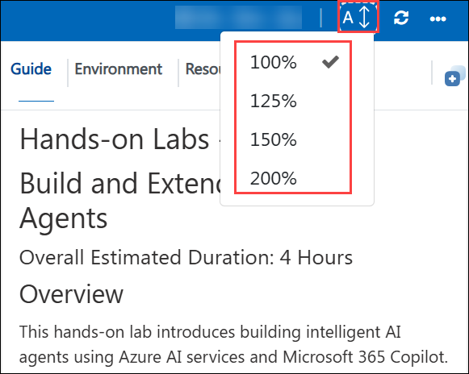
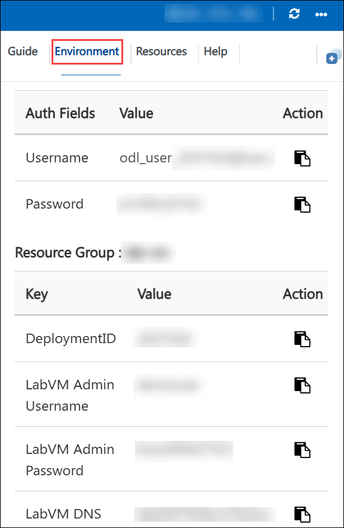
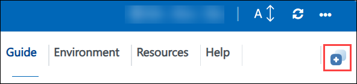
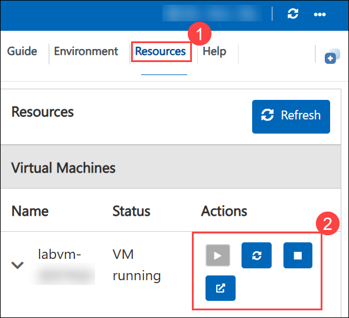
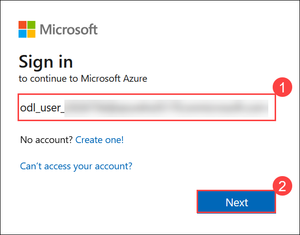
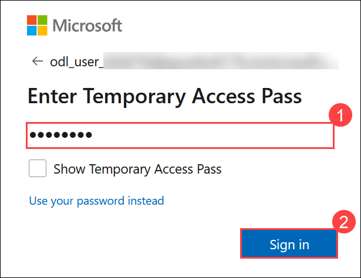

# Day 01: Migrate to Microsoft Fabric

## Overall Estimated Duration: 4 Hours

### Overview

In this hands-on lab, you will gain comprehensive, hands-on experience in migrating data and metadata from **Azure Synapse Analytics** to **Microsoft Fabric Data Warehouse**. As organizations modernize their analytics platforms, Microsoft Fabric offers a unified, scalable, and fully integrated environment that simplifies data engineering, warehousing, real-time analytics, and business intelligence. 

Throughout these labs, you will create and configure Azure Synapse components, ingest sample datasets, integrate them through pipelines, set up a new Fabric workspace, and use the **Fabric Migration Assistant** to seamlessly migrate SQL objects and data into the Fabric Data Warehouse. You will learn to establish connections between Synapse and Fabric, validate migrated data, and schedule pipelines for automated data movement, ensuring business continuity throughout the migration process.

### Objectives

By the end of this day, participants will be able to:

- **Lab 1:** Execute an end-to-end migration of data from Azure Synapse Analytics dedicated SQL pools to Microsoft Fabric Data Warehouse using the Migration Assistant
- **Lab 2:** Migrate Azure Synapse Analytics SQL objects and implement data pipelines to copy data into Fabric Data Warehouse with OneLake integration and pipeline scheduling

### Pre-requisites

Participants should have:

- A working knowledge of Microsoft Azure services, including resource groups, virtual machines, and Azure SQL
- Basic experience with SQL Server and Azure Synapse Analytics, including writing T-SQL queries
- Familiarity with data warehousing concepts such as dedicated SQL pools and data integration pipelines
- Understanding of storage concepts including Data Lake Storage Gen2 and OneLake
- General awareness of how data migration and ETL processes work in cloud environments

### Explanation of Components

The architecture for this day's labs involves the following key components:

**Azure Synapse Analytics:** The source data platform providing:
- Dedicated SQL pools for structured data storage and processing
- Integration runtime for data movement and transformation
- Pipelines for orchestrating data workflows
- SQL scripts for data querying and exploration

**Microsoft Fabric Data Warehouse:** The target analytics platform providing:
- Unified storage via OneLake for seamless data integration
- SQL endpoint for querying and analysis
- Built-in pipeline support for data movement
- Integrated analytics and business intelligence capabilities

**Fabric Migration Assistant:** Automates the migration process by:
- Analyzing source schemas and dependencies
- Validating migration readiness
- Converting Synapse objects to Fabric-compatible formats
- Mapping and transferring metadata and data

**Data Pipelines:** Connect data sources to destinations by:
- Supporting copy data activities for batch data movement
- Enabling both triggered and scheduled execution
- Providing data transformation and enrichment capabilities
- Allowing integration with multiple data sources

**OneLake:** Microsoft Fabric's cloud-native data lake providing:
- Centralized storage for all Fabric workloads
- Support for structured and unstructured data
- Integration with Fabric Data Warehouse and other services

---

## Getting Started with the lab

Welcome to your Migrate to Microsoft Fabric Workshop, Let's begin by making the most of this experience.

## Accessing Your Lab Environment

Once you're ready to dive in, your virtual machine and **Guide** will be right at your fingertips within your web browser.

## Lab Guide Zoom In/Zoom Out

To adjust the zoom level for the environment page, click the **A↕ : 100%** icon located next to the timer in the lab environment.

## Virtual Machine & Lab Guide

Your virtual machine is your workhorse throughout the workshop. The lab guide is your roadmap to success.

## Exploring Your Lab Resources

To get a better understanding of your lab resources and credentials, navigate to the **Environment** tab.

## Utilizing the Split Window Feature

For convenience, you can open the lab guide in a separate window by selecting the **Split Window** button from the Top right corner.

## Managing Your Virtual Machine

Feel free to **Start, Stop, or Restart (2)** your virtual machine as needed from the **Resources (1)** tab. Your experience is in your hands!

## Let's Get Started with Azure Portal

1. On your virtual machine, click on the Azure Portal icon.

2. You'll see the **Sign into Microsoft Azure** tab. Here, enter your **credentials (1)** and select **Next (2)**:

   - **Email/Username:** <inject key="AzureAdUserEmail"></inject>

     

3. Next, provide your **password (1)** and select **Sign In (2)**:

   - **Password:** <inject key="AzureAdUserPassword"></inject>

     

      >**Note:** If you see **Temporary Access pass**, enter the the password and select **Sign In (2)**:

       - Enter **Temporary Access Pass:** <inject key="AzureAdUserPassword"></inject> **(1)**

          

4. If **Action required** pop-up window appears, click on **Ask later**.

5. If prompted to **stay signed in**, you can click **No**.

6. If a **Welcome to Microsoft Azure** pop-up window appears, simply click **"Cancel"** to skip the tour.

7. If a **Welcome to Microsoft Azure** pop-up window appears, simply click "Maybe Later" to skip the tour.

## Support Contact

The CloudLabs support team is available 24/7, 365 days a year, via email and live chat to ensure seamless assistance at any time. We offer dedicated support channels tailored specifically for both learners and instructors, ensuring that all your needs are promptly and efficiently addressed.

Learner Support Contacts:

- Email Support: [cloudlabs-support@spektrasystems.com](mailto:cloudlabs-support@spektrasystems.com)
- Live Chat Support: https://cloudlabs.ai/labs-support

Click **Next** from the bottom right corner to embark on your Lab journey!

Now you're all set to explore the powerful world of technology. Feel free to reach out if you have any questions along the way. Enjoy your workshop!
